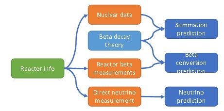
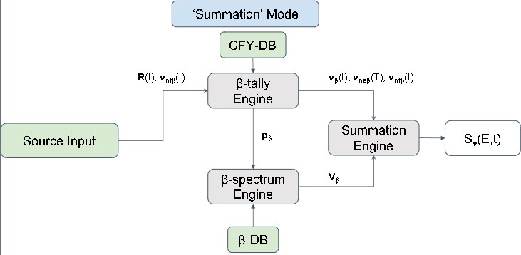
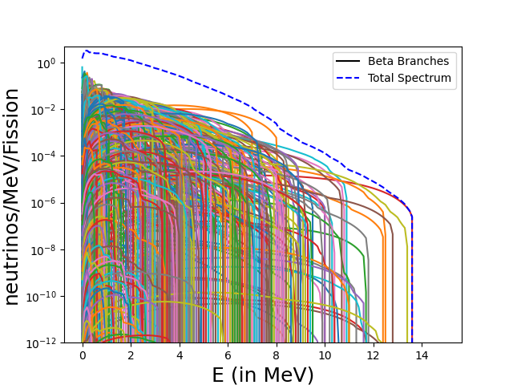
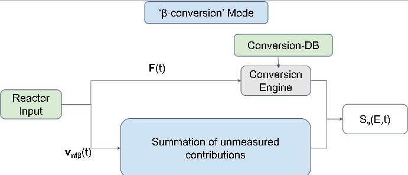

intro
*****

How Does CONFLUX Work?
======================

The CONFLUX (Calculation Of Neutrino FLUX) software framework is built with the goal of simplifying and standardizing neutrino flux calculations. CONFLUX is packaged with three prediction modes:

- Summation mode
- :math:`\beta` Conversion mode
- Direct Experimental Measurement mode

All of which calculate the Neutrino spectrum in different ways. A block diagram of how the calculation is run is provided below.

Modes
=====

Summation
---------

Summation mode is an ab-initio calculation that takes in Fission product information, either from ``ENDF``, ``JEFF``, or a ``user-defined DB``, and combines it with the spectral shape of each individual 
:math:`\beta`-branch. Thus, we sum the product of the individual branch spectra and their contributions to form the total neutrino spectrum for a given isotope. A block diagram of how the mode works,
as well as a graphical representation of the calculation is provided below.

Conversion
----------

Conversion mode converts an inputted beta spectrum of some fissile isotope and converts it into a neutrino spectrum by fitting it with ``virtual branches`` that approximate neutrino decay branches. Packaged beta databases lack corrections for non-equilibrium fission products,
however one can use the Summation calculation with prior knowledge of the modeled reactor to work around this. See also ``synth_data.py``. A block diagram of how the mode works, as well as a graphical representation of the calculation is provided below.

.. image:: Conversion_figure.jpg

Direct Experimental Measurement
-------------------------------

This is a planned prediction mode that will be implemented at a later date. More on how the calculation will be carried out can be seen here_.

.. _here: https://journals.aps.org/prl/abstract/10.1103/PhysRevLett.128.081801

Databases
=========

ENDF/JEFF
---------

.. literalinclude:: ENDF_example.txt

ENSDF
-----

.. literalinclude:: ENSDF_example.txt

FYCOM
-----

Conversion Libraries
--------------------

Beta Spectrum Generator
=======================
