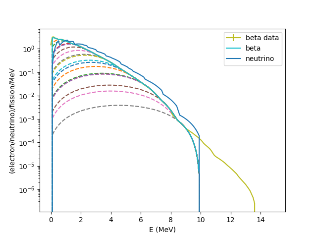

Introduction
*****

How Does CONFLUX Work?
======================

The CONFLUX (Calculation Of Neutrino FLUX) software framework is built with the goal to simplify and standardize neutrino flux calculations. CONFLUX is packaged with three prediction modes:

- Summation mode
- :math:`\beta` Conversion mode
- Direct neutrino data mode

CONFLUX uses parsered nuclear data, theoretical beta/neutrino spectrum calclation, and existing beta/neutrino measurement from fissile isotopes to calculate reactor or beta decay neutrino productions. The full documentation has been published in BLAH. 

.. image:: block_diagram.jpg

CONFLUX was built aiming to help researchers with limited programming and nuclear data knowledge to calculate neutrino flux with ease. Features include:

- Calculating neutrino spectrum and flux from customized model of nuclear reactor
- Beta and neutrino spectrum with non-zero neutrino mass
- Allow user input of covariance matrix among fission product yields
- Neutrino flux evolution over time from independent fission yields
- Calculating neutrino flux with customized beta decay function, updated nuclear data, or individually modified isotopic data

Modes
=====

Summation
---------

Summation mode is an ab-initio calculation that takes in Fission product information, either from ``ENDF``, ``JEFF``, or a ``user-defined DB``, and combines it with the spectral shape of each individual 
:math:`\beta`-branch. Thus, we sum the product of the individual branch spectra and their contributions to form the total neutrino spectrum for a given isotope. A block diagram of how the mode works,
as well as a graphical representation of the calculation is provided below.

.. image:: Summation_block.jpg

.. image:: Summation_figure.png

Conversion
----------

Conversion mode converts an inputted beta spectrum of some fissile isotope and converts it into a neutrino spectrum by fitting it with ``virtual branches`` that approximate neutrino decay branches. Packaged beta databases lack corrections for non-equilibrium fission products,
however one can use the Summation calculation with prior knowledge of the modeled reactor to work around this. See also ``synth_data.py``. A block diagram of how the mode works, as well as a graphical representation of the calculation is provided below.

.. image:: Conversion_block.jpg

Direct Experimental Measurement
-------------------------------

This is a planned prediction mode that will be implemented at a later date. More on how the calculation will be carried out can be seen here_.

.. _here: https://journals.aps.org/prl/abstract/10.1103/PhysRevLett.128.081801

Databases
=========

ENDF/JEFF
---------
ENDF and JEFF are Nuclear Databases containing Fission Yields of Individual Fission Isotopes. Either can be selected in the calculation by specificying which Database in the ``Default_DB`` variable where required.
Some key notes on the parsed data include 
- HEAD AWR
- FissionZA : This is an identifier for this specific Isotope, combining both its' atomic number and mass.
- LE
- MT : Determines whether that specific set of data is an Indpendant Yield ``IFP`` or a Cumulative Yield ``CFP``
- Ei : This is the incident neutron energy that causes the fission. Value can either be 0 (thermal), 0.5 (fast), or 14 (relativistic)
- Ii
- NFPI

.. literalinclude:: ENDF_example.txt

ENSDF
-----

.. literalinclude:: ENSDF_example.txt

FyCOM
-----
Prepackaged example covariance and correlation matrices are included for the fission products from  U-235, U-238, Pu-239, and Pu-241, calculated by the work referred in https://nucleardata.berkeley.edu/FYCoM/, a MC calculation based on ENDF.B/VIII and JEFF-3.3.
The user can download the referred covariance matrices by running

.. code-block:: bash

    python3 $CONFLUX_DB/CovMatDownloader.py

Conversion Libraries
--------------------

Beta Spectrum Generator
=======================
